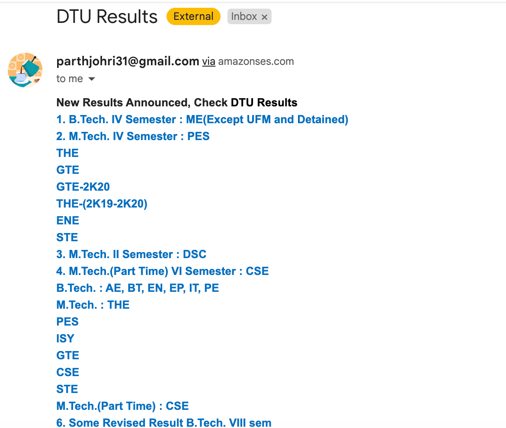

# DTU Results 

This script scrapes the results from the **DTU (Delhi Technological University) [Results](http://exam.dtu.ac.in/result.htm) website** and sends notifications to the user via email using the **Amazon SES (Simple Email Service)** whenever a new set of results is available.

## Table of Contents

- [Screenshot](#screenshot)
- [Prerequisites](#prerequisites)
- [Installation](#installation)
- [Configuration](#configuration)
- [Usage](#usage)
- [Contributing](#contributing)
- [License](#license)

## Screenshot


## Prerequisites

Before using this script, ensure that you have the following prerequisites installed:

- Python (version 3.x)
- Requests library (`pip install requests`)
- Beautiful Soup library (`pip install beautifulsoup4`)
- Boto3 library (`pip install boto3`)
- Dotenv library (`pip install python-dotenv`)

## Installation

1. Clone the repository:

   ```bash
   git clone https://github.com/your-username/dtu-results-scraper.git
   ```

2. Change to the project directory:

   ```bash
   cd dtu-results-scraper
   ```

3. Install the required dependencies either one by one or make a requirements.txt file:

   ```bash
   pip install -r requirements.txt
   ```

## Configuration

1. Rename the `.env.example` file to `.env`.

2. Open the `.env` file and provide the required configuration:

   - `REGION`: The AWS region where your SES service is configured.
   - `SENDMAIL`: The email address from which the notifications will be sent.
   - `RECEIVEMAIL`: The email address to which the notifications will be sent.

## Usage

To run the scraper and receive email notifications for new results, execute the following command:

```bash
python3 results_scraping.py
```

The script will periodically check for new results on the DTU Results website and send email notifications whenever a new set of results is available.

## Contributing

Contributions are welcome! If you have any suggestions, improvements, or bug fixes, please submit a pull request.

## License

This project is licensed under the [MIT License](LICENSE).
